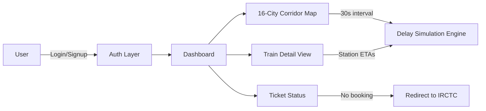

# 🚆 Indian Railways – ETA Forecast System

A passenger-focused web app that gives **dynamic, real-time Expected Time of Arrival (ETA) forecasts** for Indian Railways coaching trains — replacing the static, often-stale timetables passengers currently rely on.

> Built for [Hackathon Name] — [Track/Theme, e.g. "Smart Mobility & Public Infrastructure"]

[](#) [](#) [](#) [](#license)

**🔗 Live demo:** `<add your deployed link here>`
**🎥 Demo video:** `<add a 60–90s walkthrough link or embed a GIF here>`

---

## 📌 The Problem

Millions of Indian Railways passengers plan their day around a printed timetable that rarely reflects reality. Delays cascade silently — by the time a passenger checks, they've already missed a connection or wasted hours waiting at a station with no visibility into *why* or *by how much* their train is late.

## 💡 Our Solution

**Indian Railways ETA Forecast** simulates a live operations dashboard that:
- Tracks **24 trains** (Express, Rajdhani, Shatabdi, Duronto) across a **16-city corridor**
- Surfaces **color-coded delay status** per city, refreshed every 30 seconds
- Gives passengers a **station-by-station predicted arrival** for their specific train, not just a single "delayed" flag
- Ties directly into a passenger's **own ticket status**, linking out to IRCTC for anyone who hasn't booked yet

## ✨ Features

| Feature | Description |
|---|---|
| 🔐 Login & Sign-up | Full auth flow, or jump in with the demo account below |
| 🎫 Ticket Status | Confirms booking status; unbooked users are routed to IRCTC |
| 🗺️ 16-City Corridor Map | Live, color-coded delay visualization across the network |
| 🚉 Station-by-Station Tracking | Predicted arrival times per stop for any tracked train |
| 📊 24 Train Records | Real intercity Express, Rajdhani, Shatabdi & Duronto services across the four metros |
| ⏱️ Real-Time Simulation | Delays and train position update automatically, no manual refresh |

## 🖼️ Screenshots

`<Add 2–3 screenshots or a GIF here: login screen, corridor map, train detail view>`

## 🏗️ Architecture



## 🧰 Tech Stack

- **React 19** + **TypeScript**
- **Vite** — build tooling & dev server
- **Tailwind CSS v4** — styling
- **React Router** — client-side routing
- **Vitest** — unit testing

## 🚀 Getting Started

```bash
git clone https://github.com/angsumanchakrabarti-creator/Indian-Railways-ETA-Forecast.git
cd Indian-Railways-ETA-Forecast
npm install
npm run dev
```

Open **http://localhost:5173**

### Windows shortcut
Double-click **Indian Railways ETA** on your Desktop (via `launch-app.bat` / `launch-app.ps1`) to launch the app without touching the terminal.

## 🧪 Demo Account

Use this account to see a **confirmed booking** end-to-end:

| Field | Value |
|---|---|
| Email | `demo@railways.gov.in` |
| Password | `demo123` |
| Booking | Train **12345 Poorva Express**, PNR `4521987634`, Delhi → Kolkata → Chennai |

New sign-ups start with **no ticket booked** and see a "Book Your Ticket" button linking to [IRCTC](https://www.irctc.co.in/nget/train).

## 📜 Scripts

```bash
npm run dev      # Start dev server
npm run build    # Production build
npm run test     # Run unit tests
npm run preview  # Preview production build
```

## 🗺️ Roadmap

- [ ] Replace simulated delay engine with real NTES/IRCTC data feeds
- [ ] Push notifications for delay changes on a user's booked train
- [ ] Predictive ETA using historical delay patterns (ML model) instead of simulation
- [ ] Multi-language support (Hindi + regional languages)
- [ ] Offline-first PWA support for low-connectivity stations

## 👥 Team

| Name | Role | GitHub |
|---|---|---|
| `<Name>` | `<Role>` | `<link>` |
| `<Name>` | `<Role>` | `<link>` |

## 📄 License

MIT — see [LICENSE](LICENSE) for details.

---

*Built with ❤️ for [Hackathon Name] [Year].*


